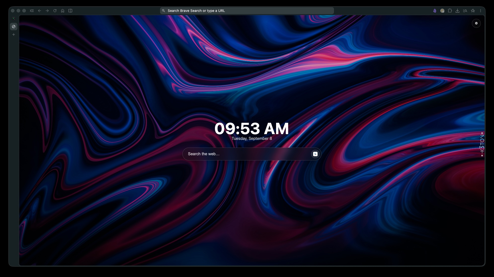
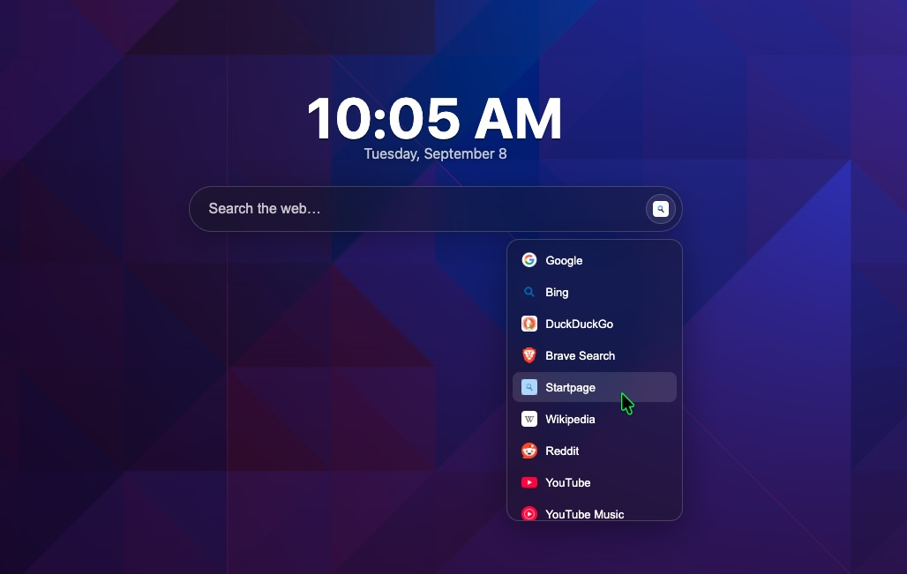

# Custom New Tab Page

A single-file New Tab page for Helium (or any Chromium-based browser that exposes a
custom-new-tab-page flag): a clock, a multi-engine search bar, and a wallpaper that
rotates randomly through a folder of your own images on every new tab.

## Screenshots

## Requirements

- A Chromium-based browser with a **custom New Tab Page** flag. Confirmed working on
  [Helium](https://helium.computer). Standard Chrome, Edge, and Brave do **not** expose
  this flag — they only allow a New Tab override from an installed extension, not a raw
  local file. If your browser doesn't have an equivalent flag, this won't work without
  turning it into an extension, which this project doesn't do.
- For the wallpaper folder feature specifically: a browser that supports the
  [File System Access API](https://developer.mozilla.org/en-US/docs/Web/API/File_System_Access_API)
  (`showDirectoryPicker`). This is Chromium-only, and some Chromium browsers disable it
  by default even though the code is present — Brave is a known example. If it's
  unavailable, the page falls back to drag-and-drop (see below).

## Setup

Helium itself is available for macOS, Windows, and Linux from
[imputnet/helium](https://github.com/imputnet/helium) — the `custom-ntp` flag used
below is documented as working on all three.

1. Download `index.html` and put it somewhere permanent — moving it later means
   re-pointing the flag below.
2. In Helium, go to `helium://flags/#custom-ntp`, enable **Custom New Tab Page URL**,
   and set its value to the file's path as a `file://` URL. The format differs by OS:

   | OS | Example |
   |---|---|
   | macOS | `file:///Users/you/path/to/index.html` |
   | Linux | `file:///home/you/path/to/index.html` |
   | Windows | `file:///C:/Users/you/path/to/index.html` |

   On Windows specifically: File Explorer's address bar shows paths with backslashes
   (`C:\Users\you\...`) — you need to flip those to forward slashes and add `file:///`
   in front, as in the example above. Typing the backslash version into the flag won't
   work.
3. Go to `helium://settings/onStartup` and choose **Open the New Tab Page**.
4. Open a new tab (⌘T on macOS, Ctrl+T on Windows/Linux) to confirm it loads.

## Using it

- **Wallpaper**: click the ⚙ button (top right) to pick a folder of images. A random
  image from that folder is shown on every new tab. Your browser will occasionally ask
  you to re-grant access to the folder — this happens after a full quit of the browser
  (not just closing a window), and is normal Chromium permission behavior, not a bug.
  Clicking the ⚙ button again re-connects it.
- **No folder access on your browser?** Drag and drop image files anywhere on the page
  instead — they're stored in the browser's local database and used the same way.
- **Search**: type and hit Enter to search, or type a bare URL/domain to navigate
  directly. Click the small icon at the right edge of the search bar to pick a
  different search engine — the list includes Google, Bing, DuckDuckGo, Brave Search,
  Startpage, Wikipedia, Reddit, YouTube, YouTube Music, and Wallhaven.
- **Keyboard shortcut**: press `/` anywhere on the page to jump into the search box.

## Customizing

Everything lives in one file, `index.html`. A few starting points if you want to
change something:

- **Search engines**: edit the `ENGINES` object near the top of the `<script>` block —
  add, remove, or reorder entries. Each needs a `name` and a `url` with the query
  parameter placed right before where the search term gets appended. Favicons are
  fetched automatically from each engine's own domain, nothing extra to configure.
- **Colors / look**: the `:root` block at the top of the `<style>` section defines the
  glass-panel color, border color, and text colors used throughout — change those
  instead of hunting through individual rules.
- **How long a wallpaper avoids repeating**: `RECENT_WALLPAPER_CAP` near the wallpaper
  code controls how many recently-shown images are excluded before one can repeat.
  Raise it for less repetition (needs a bigger photo folder to feel natural), lower it
  if you'd rather see more repeats.

## Privacy note

Favicons (for the search-engine picker) are fetched from a public Google endpoint per
engine, which means the engine's domain name is sent to Google on each page load. No
other network requests happen — search queries, wallpaper images, and your engine
choice never leave your machine unless you actually submit a search.

## Known limitations

- The wallpaper folder connection can need re-approval after a full browser quit
  (see above) — this is intentional browser security behavior, not something this
  project can override.
- Live search-as-you-type suggestions aren't implemented. Most search engines don't
  expose a suggestion endpoint that's reachable from a plain webpage (no CORS support),
  so this was left out rather than half-implemented for only 2-3 engines.

## License

MIT — see `LICENSE`.
