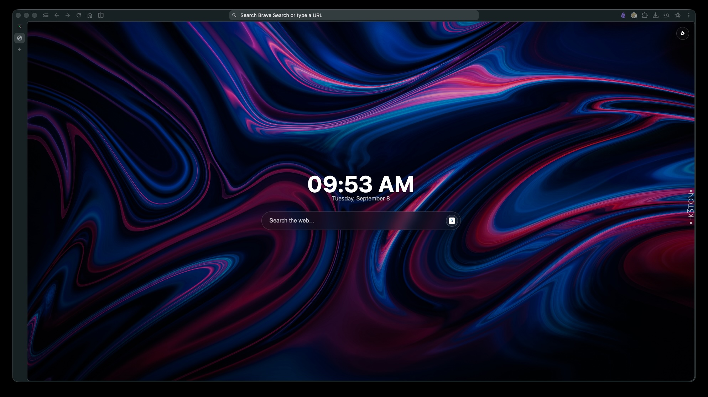
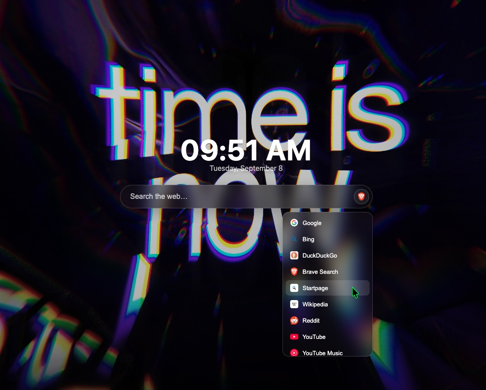

# New Tab ~/

A New Tab page for any Chromium-based browser: a clock, a multi-engine search bar, and
a wallpaper that rotates randomly through a folder of your own images on every new tab.

## Screenshots

## Requirements

- Any Chromium-based browser (Chrome, Edge, Brave, Helium, etc.), or Titanium on
  Android — see **Setup** below for how to install it.
- For the wallpaper folder feature specifically: a browser that supports the
  [File System Access API](https://developer.mozilla.org/en-US/docs/Web/API/File_System_Access_API)
  (`showDirectoryPicker`). This is Chromium-only, and some Chromium browsers disable it
  by default even though the code is present — Brave is a known example. If it's
  unavailable, the page falls back to drag-and-drop (see below).

## Setup

There are two ways to install this, depending on your browser. If you're not sure which
applies, use the extension method — it works everywhere.

### Option A: Load as an extension (any Chromium browser)

This works on Chrome, Edge, Brave, Helium, or any other Chromium-based browser, with no
flags involved.

1. Download this whole repository (the **Code → Download ZIP** button on GitHub, or
   `git clone`) and unzip it somewhere permanent. Don't move it afterwards: an unpacked
   extension's ID comes from its folder path, so a new location is a new extension to
   the browser (folder access and saved wallpapers reset).
2. Go to your browser's extensions page — `chrome://extensions`, `edge://extensions`,
   `brave://extensions`, or `helium://extensions` — and enable **Developer mode**
   (usually a toggle in the top-right corner).
3. Click **Load unpacked** and select the folder containing `manifest.json`.
4. Open a new tab to confirm it loads. If you edit the files later, come back to this
   page and click the reload icon on the extension's card — a plain page refresh won't
   pick up changes to `manifest.json`, `index.html`, or `app.js`.

### Option B: Browser flag (Helium and similar forks)

Some Chromium forks — [Helium](https://helium.computer) confirmed — expose a flag that
lets a raw local file serve as the New Tab page directly, without installing anything.
Helium itself is available for macOS, Windows, and Linux from
[imputnet/helium](https://github.com/imputnet/helium).

1. Download `index.html` and `app.js` into the same folder, somewhere permanent —
   moving it later means re-pointing the flag below.
2. In Helium, go to `helium://flags/#custom-ntp`, enable **Custom New Tab Page URL**,
   and set its value to the file's path as a `file://` URL. The format differs by OS:

   | OS | Example |
   |---|---|
   | macOS | `file:///Users/you/path/to/index.html` |
   | Linux | `file:///home/you/path/to/index.html` |
   | Windows | `file:///C:/Users/you/path/to/index.html` |

   On Windows specifically: File Explorer's address bar shows paths with backslashes
   (`C:\Users\you\...`) — you need to flip those to forward slashes and add `file:///`
   in front, as in the example above. Typing the backslash version into the flag won't
   work.
3. Go to `helium://settings/onStartup` and choose **Open the New Tab Page**.
4. Open a new tab (⌘T on macOS, Ctrl+T on Windows/Linux) to confirm it loads.

### Android (Titanium)

Chrome for Android can't run extensions;
[Titanium](https://github.com/jqssun/android-titanium-browser) can. Tested on Titanium
only.

1. Download the repository ZIP and extract it on the phone.
2. In Titanium, open `chrome://extensions`, enable **Developer mode**, tap **Load
   unpacked**, and pick the extracted folder that contains `manifest.json`.
3. Open a new tab. Use the ⚙ button to choose wallpaper images.

## Using it

- **Wallpaper**: click the ⚙ button (top right) to pick a folder of images. A note at
  the bottom-left offers the same button on first run and when access needs
  reconnecting. A random image from that folder is shown on every new tab. When the browser asks for folder
  access, choose **Allow on every visit** so it persists across restarts; if it asks
  again, click the ⚙ button to re-connect. On Helium, the extension install (Option A)
  offers that choice; the `file://` install (Option B) only offers a one-time allow,
  so access resets after each full browser quit.
- **Touch device, or no folder access?** The ⚙ button opens an image chooser instead,
  and drag and drop also works. Chosen images are copied into the browser's local
  database and used the same way.
- **Search**: type and hit Enter to search, or type a bare URL/domain to navigate
  directly. Click the icon at the right edge of the search bar to pick an engine:
  **Browser default** (extension installs only; uses your browser's own search engine
  and is the default), Google, Bing, DuckDuckGo, Brave Search, Startpage, Wikipedia,
  Reddit, YouTube, YouTube Music, or Wallhaven. Choose **+ Add search engine** to add
  your own: a name and a URL with `%s` where the search term goes, such as
  `https://example.com/search?q=%s`. Remove a custom engine with its ×. The `file://`
  install (Option B) can't reach the browser default, so it defaults to Google.
- **Keyboard shortcut**: press `/` anywhere on the page to jump into the search box.

## Customizing

Markup and styles are in `index.html`, behavior in `app.js`. A few starting points if
you want to change something:

- **Search engines**: edit the `ENGINES` object in `app.js` —
  add, remove, or reorder entries. Each needs a `name` and a `url` with `%s` where the
  search term goes. Favicons for these built-in entries are fetched automatically from
  each engine's domain, nothing extra to configure.
- **Colors / look**: the `:root` block at the top of the `<style>` section in `index.html` defines the
  glass-panel color, border color, and text colors used throughout — change those
  instead of hunting through individual rules.
- **How long a wallpaper avoids repeating**: `RECENT_WALLPAPER_CAP` in `app.js`
  controls how many recently-shown images are excluded before one can repeat.
  Raise it for less repetition (needs a bigger photo folder to feel natural), lower it
  if you'd rather see more repeats.

## Privacy

No data leaves your browser except favicon lookups. The search-engine picker fetches
the built-in engines' icons from a public Google endpoint, which means those engines'
domain names (e.g. "google.com", "wikipedia.org") are sent to Google every time the
page loads — that's the one exception. Engines you add yourself get a generated letter
icon and make no requests, so a private search address never leaves your browser.
Everything else stays entirely on your machine: your
wallpaper images, which folder you connected, your chosen search engine, and anything
you type into the search box are never transmitted anywhere, with the obvious exception
of actually submitting a search — which sends that query to whichever engine you
picked, the same as typing it directly into your browser's address bar would.

The extension requests one permission, `search`, used only to run your searches through
the browser's default search engine. Full policy: [PRIVACY.md](PRIVACY.md).

## Known limitations

- With Option B (`file://`), folder access is one-time only and must be re-granted
  after each full browser quit. Option A avoids this.
- Live search-as-you-type suggestions aren't implemented. Most search engines don't
  expose a suggestion endpoint that's reachable from a plain webpage (no CORS support),
  so this was left out rather than half-implemented for only 2-3 engines.

## License

MIT — see `LICENSE`.
